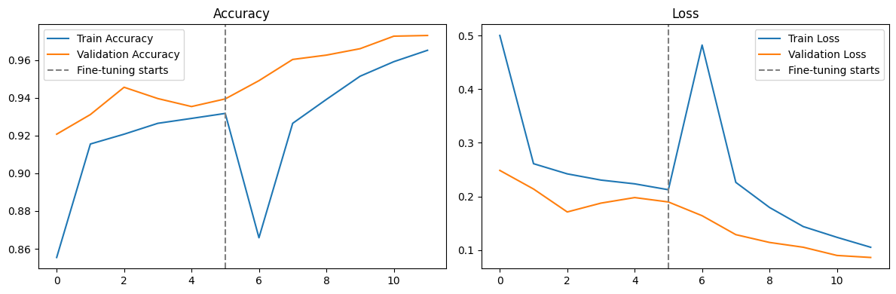
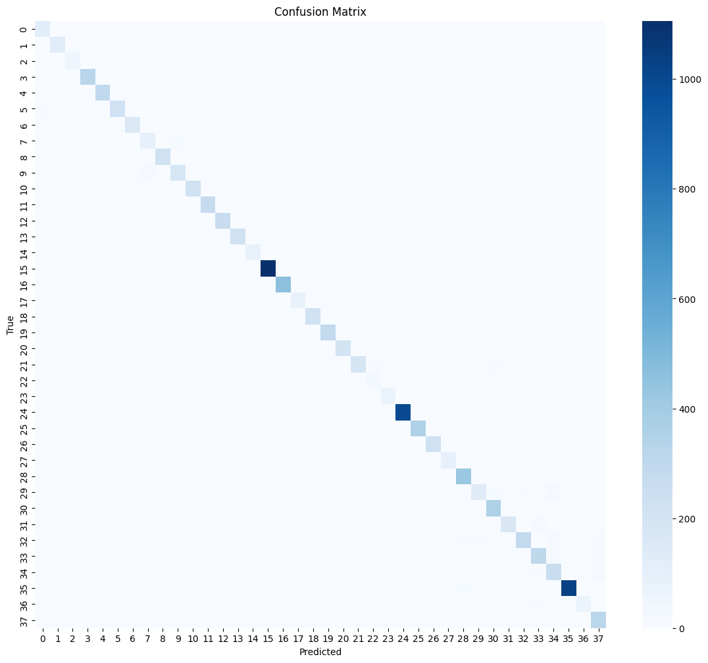
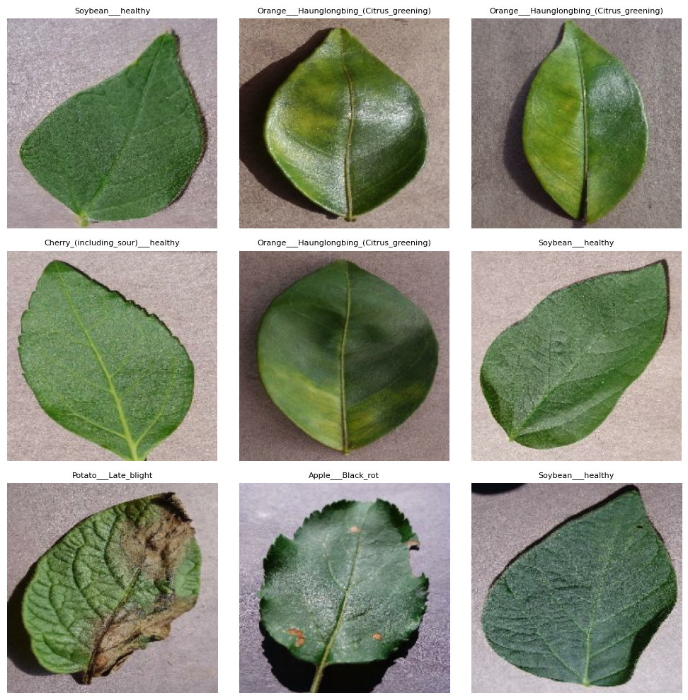

# 🌱 Crop Disease Detection

A deep learning model that identifies plant diseases from a photo of a leaf,
wrapped in a Streamlit demo app with treatment recommendations.

## Problem statement

Crop disease is a major driver of yield loss worldwide, and early, accurate
identification is often the difference between a treatable problem and a
lost harvest. Manual diagnosis requires expert knowledge that isn't always
available to smallholder farmers in the moment they need it. This project
trains a computer vision model that can identify 38 crop/disease
combinations from a single leaf photo, then wraps it in a simple app so
anyone can try it in a browser — no ML background required.

## Dataset

[PlantVillage](https://www.kaggle.com/datasets/abdallahalidev/plantvillage-dataset)
— ~54,300 labeled leaf images across 38 classes, covering 14 crop species
(apple, blueberry, cherry, corn, grape, orange, peach, bell pepper, potato,
raspberry, soybean, squash, strawberry, tomato) each with one or more
disease categories plus a healthy class. Split 80/20 train/validation
(43,444 / 10,861 images).

## Approach

- **Model:** MobileNetV2 pretrained on ImageNet, used as a frozen feature
  extractor with a custom classification head (`GlobalAveragePooling2D` →
  `Dropout(0.3)` → `Dense(38, softmax)`).
- **Training:** two-phase transfer learning —
  1. **Phase 1** (8 epochs): base model frozen, head trained from scratch
     at `lr=1e-3`.
  2. **Phase 2** (6 epochs, fine-tuning): last 30 layers of the base model
     unfrozen and trained at a much lower `lr=1e-5` to adapt high-level
     features to plant leaves without destroying pretrained weights.
- **Data augmentation:** random horizontal flip, rotation, and zoom on the
  training set to reduce overfitting.
- **Regularization:** early stopping on validation accuracy (patience 3),
  checkpointing the best weights after every epoch.

Full details, including comments explaining every design decision (batch
size, why XLA JIT is disabled, memory-buffer tuning for Colab's free GPU
tier), are in [`notebook/Crop_Disease_Detection.ipynb`](notebook/Crop_Disease_Detection.ipynb).

## Results

| Metric | Value |
|---|---|
| Validation accuracy | **97.3%** |
| Weighted avg F1 | **0.97** |
| Macro avg F1 | **0.96** |
| Validation set size | 10,861 images |

Per-class performance ranged from F1 0.82 (Tomato Early Blight, a visually
similar condition to several other tomato diseases) up to a perfect 1.00 on
several distinctive classes (e.g. Grape Leaf Blight, Citrus Greening).

**Training curves** (accuracy/loss across both phases — the dashed line
marks where fine-tuning begins):



**Confusion matrix** (validation set, 38 classes):



**Sample predictions from the training set:**



## Demo app

A Streamlit app (`app/app.py`) wraps the notebook's `predict_disease()`
function: upload a leaf photo, get the predicted class, confidence score,
top-3 alternatives, and a treatment recommendation pulled from a lookup
table covering all 38 classes.

**Accessibility — built for users who can't read or write:**
- **Local languages:** a sidebar language picker (Hindi, Bengali, Tamil,
  Telugu, Marathi, Kannada, Gujarati, Punjabi, or English) translates the
  prediction, description, and treatment on the fly.
- **Listen to the result:** a "🔊 Listen to result" button speaks the
  translated result aloud, so a diagnosis never requires reading text.
- **Voice search:** a second tab lets someone record themselves saying a
  crop and condition (e.g. *"tomato early blight"*) instead of uploading a
  photo — useful when they already know roughly what's wrong and just want
  the treatment read back to them, no typing or reading required.

Voice output and translation call external services (Google Text-to-Speech
and Google Translate via `gTTS`/`deep-translator`) and voice search uses an
online speech-recognition API — all three need internet access at runtime,
same as the app itself once deployed.

<!-- Add a screenshot of the running app here once you have the model file:

-->

<!-- Optional: link a short screen recording of the app in action, e.g.
a Loom or GitHub-hosted mp4/gif:
[Watch a 30-second demo](docs/demo.gif)
-->

### Running it locally

```bash
cd app
pip install -r requirements.txt
streamlit run app.py
```

The app needs the trained model files in `app/models/` first — see
[`app/models/README.md`](app/models/README.md) for how to get them (the
`.keras` file is git-ignored since it's too large to commit directly).

## Repo structure

```
crop-disease-detection/
├── notebook/
│   └── Crop_Disease_Detection.ipynb   # data pipeline, training, evaluation
├── app/
│   ├── app.py                         # Streamlit demo
│   ├── treatments.py                  # class -> description/treatment lookup
│   ├── voice.py                       # translation, text-to-speech, voice search
│   ├── requirements.txt
│   └── models/
│       ├── class_names.json           # the 38 class labels, in model order
│       └── README.md                  # how to get the .keras model file
├── docs/
│   └── screenshots/                   # training curves, confusion matrix, app demo
└── README.md
```
## Live Demo

Streamlit App:
https://crop-disease-detection-bdbdljhb4ig9ddwe4yoavw.streamlit.app/
## What's next

- Video evidence of the app running (screen recording) for the README.
- Expand the treatment dictionary with region-specific guidance, or source
  it from a maintained agricultural database instead of a static dict.
